## Overview

### Summary

This repository contains multiple subprojects:

1. An application which detects faces in images from a live camera feed, extracts distinct facial signatures, and publishes unique detection events to a message bus.
2. A backend http server for adding labeled user information and facial signatures to a database and publishing sign-up events.
3. A wasm frontend for signing up with information and images.
4. A binary which consumes detection and sign-up events.
5. A library for shared code.

### Goal

Perform person identification and perform the appropriate response action, allowing for labels to be created _after_ detection and for different responses per application.

My first use case is to tackle a personal problem of mine (not signing in at the gym) by automatically detecting myself on gym security camera footage and sending an API request. Eventually, this may be extended to other users easily via an opt-in approach, where a user may _e.g._, supply an image of themselves which may then be used to generate their reference embedding and automatically determine classes they attend--even retroactively.

### Application Workflow

```mermaid
%%{ init: {"theme": "dark"} }%%
flowchart
    subgraph Detection
    ce[fa:fa-person Client Enters] --> fd[fa:fa-camera Detect Face]
    fd --> ge[fa:fa-fingerprint Generate Facial Embedding]
    ge --> kc{fa:fa-clock\nUnique Face in\nTime Window?}
    kc --> |Yes| db[(Send Crop to\n Object Storage)] --> pe[fa:fa-envelope Publish Event to\nMessage Bus]
    kc --> |No| p{Privacy?}
    p --> |No| tr[fa:fa-shoe-prints Track Without Label]
    p --> |Yes| d[fa:fa-trash Discard]
    pe --> ar[fa:fa-envelope-open Asynchronous Action\ne.g., Sign-in]
    tr --> wfl{Wait for Label}
    end

    subgraph Labeling
    oi[fa:fa-user-plus Opt-in with User Information\nand Reference Image] --> gs[fa:fa-fingerprint Generate Facial Signature]
    gs --> pl[fa:fa-envelope-circle-check Publish New Label Event]
    pl --> wfl
    wfl --> ra[fa:fa-address-card Retroactively Identify]
    end
    ra --> pe

    classDef sg fill:#133
    class Labeling sg
    class Detection sg
```

